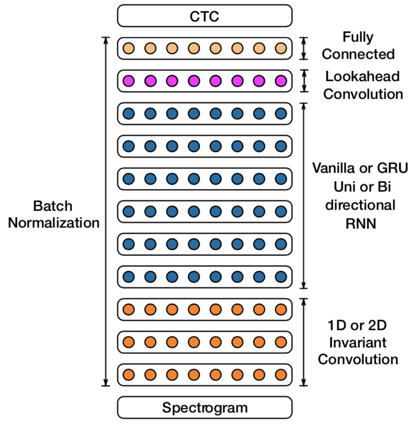
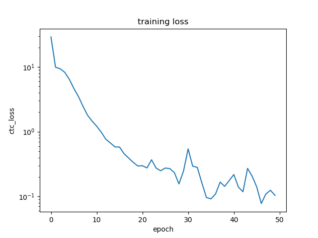

# Digital Speech Processing Final Project Report
Deep Speech 2 and A Simplified Adaption to the Homework 2 Recognition Task  
Author: B03901052 王傑生  
Instructor: Prof. Lin-shan Lee

## I. Introduction
Traditional HMM approach has shown decent performance in speech recognition, while recently, deep learning has become more and more popular, and people started to wonder whether better result can be achieved with deep learning. In chapter 9 in the lecture, 2 different approaches, tendem and hybrid system, are introduced to show how neural networks can be combined with the traditional HMM in speech recognition. However, these methods are still mainly the traditional HMM model with some submodel supported or replaced by neural networks.

Today, some researches shows that it is possible to do the task end-to-end with neural networks and have performance not to far from the traditional HMM method. Several difficulties have to be encountered to fully get rid of the HMM model, for example, dealing with variable length sequences and unsegmented data, a differentiable loss function to do back propagation ,and huge training time needed. The following sections are going to summarize the model and techniques used to solve these problems in a 2017 Baidu paper Deep Speech 2, reproduce a simplified model for Homework 2 Chinese digit recognition task, and discuss the result.

## II. Model and Techniques

#### 1. Model Architecture Overview
The figure shows the architecture of the model. Utterances are converted to spectrograms as the input of the model. One or more layers of either 1D or 2D Convolutional Layer follows. And then one or more layers of uni- or bidirectional RNN or GRU is connected, followed by a lookahead convolutional layer and a fully-connected layers. Finally, a softmax layer produces the outputs. At each time step, the RNN takes an input and produces an output. The set of output classes for English is alphabets, space, apostrophe and blank for CTC loss, which will be discussed in another part of the section. For Chinese, the output classes is the most frequently used ~6000 Chinese characters, and possibly alphabets for hybrid Chinese-English cases. The outputs are compared to the label sequences to compute CTC losses for back propagation training. 

{height=300}


#### 2. RNN & GRU
By using Recurrent neural network (RNN), output of each time step is determined by the output of previous time step and the input, which can be think of as the network having memories, thus suitable for this sequence-to-sequence task. Like Long short-term memory (LSTM), GRU is a more complex version of RNN cell which use additional gates to control the behavior of the cell. There are only 2 gate, reset and update gate, in GRU compared to 3 in LSTM. The reset gate determines the portion of the previous output used, combining with the input to compute the new memory. The output is the weighted average of the new memory and the previous output, where the weight is controlled by the update gate. Due to the lack of output gate, GRU has less parameter than LSTM, and faster to train. In the paper, it is stated that GRU and LSTM has similar performance under experiment with smaller dataset but faster to train and less likely to diverge, and thus, GRU is preferred over LSTM.

#### 3. CTC Loss
The main issue in end-to-end training is that the data is unsegmented. That is, which label belonging to which time segment of the input sequence is unknown. CTC (Connectionist Temporal Classification) is a method to deal with the problem, allowing the network to output a sequence of probability vector longer than the target label sequence, which later being decoded to the target sequence. In the following paragraphs, how decoding and the loss calculation is done is discussed respectively.

For the decoding process, the output sequence of the network denotes the probability of each output class at each time step. A many-to-one mapping from the sequence of classes to the shorter target label sequence is defined, where repeated labels and then blanks are removed. For example, "AAABB" will become "AB", and both "A_AA_BB" and "AA_ABB_" will become "AAB". The blank symbol "_" allows the occurrence of repetition of a character in the target label sequence. Then, the probability of a label sequence can be defined: $p(l|x)=\sum_{M(\pi)=l}p(\pi|x)$, where $M$ is the mapping and $\pi$ is all possible network-output-length sequences. The goal is to find a label sequence that maximize the probability given input sequence $x$. $l^* = argmax_{l}\ p(l|x)$. While there does not exist a polynomial time algorithm, approximation can be found by picking the best output class at each time step($l^*\approx M(\pi^*)$) or using beam search. For application in speech recognition, language model can also be integrated in the decoding process for better result.

The loss is defined as the negative log-likelihood: $-\log{p(l|x)}$. To calculate $p(l|x)$, a forward-backward dynamic programming algorithm similar the HMM training one can be used. First, define foward variable $\alpha_t(s) = \sum_{M(\pi_t)=l_s} p(\pi_t|x)$, where $\pi_t$means output-length class sequence up to time step $t$, $l_s$ means the subsequence of the first $s$ units of the label sequence. A recursion of $\alpha$ can be established. $\alpha_t(s) = (\alpha_{t-1}(s)+\alpha_{t-1}(s-1)) p(y_t=l'_s|x)$ if $l'_s=blank\ or\ l'_{s-2}$. Else, $\alpha_t(s) = (\alpha_{t-1}(s)+\alpha_{t-1}(s-1)+\alpha_{t-1}(s-2)) p(y_t=l'_s|x)$, where $l'$ is $l$ with blank inserted between all symbols including beginning and end. Then, $p(l|x) = \alpha_T(|l'|) + \alpha_T(|l'-1|)$. The backward variable $\beta$ is nearly the same as $\alpha$ except for the opposite direction (i.e. $t$ and $s$ are starting from the position to end). As the product of $\alpha$ and $\beta$ is gives the probability of all $\pi$s corresponding to $l'$ with symbol $l'_s$ at time $t$. With some rearranging, for any $t$, $p(l|x) = \sum_s \frac{\alpha_t(s)\beta_t(s)}{p(y_t=l'_s)}$. With the equation, differentiation for back propagation can be computed.

#### 4. Batch Normalization
In neural network training, a problem is that the output value distribution of each layer (i.e. input distribution for the next layer) changes during training, because the input distribution and the parameters of the layer may change. One way to resolve the issue is to normalize the value between layers within a batch. the value is further scaled to another distribution with learnable parameters. Let $\hat{x_i}$ be the normalized value for an output element and $\mu$ and $\sigma$ be the mean and standard deviation of the elements in the batch. $\hat{x_i} = \frac{x_i-\mu}{\sqrt{\sigma^2+\epsilon}}$. $\epsilon$ is a small value for numerical stability and to prevent divide-by-zero issue. The final output of batch normalization $y_i = BN(x_i) = \gamma \hat{x_i} + \beta$, where $\gamma$ and $\beta$ are learnable parameters, making the model more flexible, as zero mean and one variance are not always the best. 

In general, batch normalization can speed up the training as stated in its original paper. Research has also shown that it can make RNN training converge faster. The paper demonstrates that a variant of batch normalization used not only accelerates the training, but also improves the recognition result when applying on a large dataset. Two ways to apply batch normalization to recurrent operation are mentioned in the paper, and the sequence-wise one, which only normalize the vertical connection (input part) but not the time series connection (the previous hidden state), shows improvement in both training speed and performance.

#### 5. Other Techniques
Other techniques used includes SortaGrad, frequency convolution, and lookahead convolution. SortaGrad is used to resolve the problem that as a very deep RNN training can be unstable and failed in the early stage. It uses utterance length as a heuristic of difficulty, and trains with increasing difficulty especially in the first epoch. Frequency convolution convolute along both frequency and time series (i.e. 2D convolution on the spectrogram), and achieve better result than simply convolute along time series. Lookahead convolution takes the current output of RNN and some later outputs in the unidirectional RNN model. It allows some future information for unidirectional RNN that is important for better performance, while keeps the delay in an acceptable range, which can be seen as eclectic choice between the performance of bidirectional model and the low latency of unidirectional model.

## III. Performance
Some experiment result shows the effectiveness of some of the above techniques including SortaGrad, batch normalization, GRU and frequency convolution. And using the best model, experiments under different datasets are executed and the results of WER are compared with human worker results without rewards and auto-correction. On high SNR corpus of news and audio book reading datasets, the model either outperform of tie with human workers. Similar result on the datasets with accent proves the robustness of the model. On noisy datasets, the model performance is worse than that of the human workers and the gap is larger under real noisy environment than that under synthesized noise. There are also experiments for Chinese showing that the model outperforms native speakers under the short query-like test.

In conclusion, although the experiments are mostly done under specific audio, which means the result does not means that the model is comparable to human under everyday circumstances, and there is no comparisons between it and other models such as HMM, the model do demonstrate a decent performance and the feasibility for end-to-end speech recognition model. 

## IV. Adaption to the Homework 2 Recognition Task
Since directly reproducing the result in the paper, which trained an entire end-to-end recognition model for a language with tens of millions of parameters, would require tremendous computational resources, space and time, in the project, a simplified version of the model for the homework 2 Chinese digit recognition task is trained, tested and compared to the result of the HMM model in homework 2.

The model uses 39-dimension MFCC instead of spectrogram as the input for simplicity. 3 layers of fully-connected layers of size 128 follow. Since MFCCs already have the temporal difference features, CNN is not adopted. A layer of 128 unidirectional GRUs and a fully-connected layer of size 64 is connected afterwards. Finally, there is a softmax layer of 11 outputs (0~9 and blank). There is a batch normalization layer right after the input and right before the RNN. The activation function used for fully-connected layers is relu and the optimizer is adam. SortaGrad and lookahead convolution are not applied.

The data used for training and testing are exactly the same as those used in homework 2 (2239 short voice data for training, which is fairly small for RNN training). The model is first trained with a portion of data split for validation to find the ideal number of epochs. Then the whole training data is used for the final model. Batch size of 32 and 50 epochs are adopted. The training process takes about 2~3 minutes on an AMD R5-1600 CPU and Nvidia GTX1060 6G GPU (more than 10 times longer on pure CPU). 

## V. Implementation
The MFCC data is read into numpy array using pyHTK, an open source python implementation of HTK, and processed with zero padding for input. The model is implemented using keras with tensorflow flow backend. In testing, the output CTC sequence is decoded by simply picking the most possible output of each time step, and converted to HTK mlf format (note that the testing data has different label name to the training data). Finally use HTK HResult to calculate the accuracy as in homework 2.

Some notices during the implementation is stated as follows. First, the pyHTK source code seems to use different endian to the HTK file, causing wrong read values. The pyHTK file included in this project's source code is modified for correct result. The second issue is to correctly wrap the tensorflow backend CTC loss function to use in keras, which is quite tricky. Most of the part is referenced from keras image_ocr example. The third is about the version of keras GRU model used. There is an original GRU model which can be used on both CPU and GPU. However, with this GRU, the training speed on GPU is not much faster than that on CPU, and to really accelerate the training, the CuDNNGRU, which is the CUDA CuDNN GPU implmentation and connot be run on a CPU, have to be chosen.

To reproduce the result, first, make sure CUDA, CuDNN, tensorflow with GPU support, keras, numpy, matplotlib and HTK are installed. The python version used is 3.6.1. Under the source code directory, ```python test.py``` to use the trained model to make prediction of test data. The prediction will be located at ```result/result_nn.mlf``` and the result will be append to ```result/accuracy_nn```. ```python train.py``` to re-train the model, and note that the current model will be overwritten. To add more training/testing data, put the HTK MFCC file under ```MFCC/training```/```MFCC/testing``` and make sure all the data have labels in ```labels/Clean08TR.mlf```/```labels/answer.mlf```. Also, be careful about the difference label names used in training and testing. The code has been tested under macOS 10.13.4 and Ubuntu 16.04.

## VI. Result and Discussion
The model is first implemented without batch normalization, and reach accuracy of ~91% at best. After adding batch normalization to the input and RNN, the best accuracy achieved is about 96%, which pass the criterion of 95% set in homework 2. The graph of the training loss is shown below. 

{height=300}

The result shows that it may be possible to approach the performance of HMM model speech recognition with an end-to-end RNN model under the simple task, though with much more computational resource and time used. As many part of the model is not the best choice due to simplicity, and few training data are used, it is likely that the performance can be better with more training data or better CTC decoding scheme such as beam search. 

## VII. Conclusion
To summarize, the popular deep learning does have the potential in speech recognition, and maybe doing even better than traditional methods someday. But this also brings out the powerfulness of the elaborately designed, with decades of accumulation, traditional HMM model, which is able reach a fairly good performance under limited amount of data, less computational resources, and shorter time.

## VIII. Reference
1. Deep Speech 2 paper: https://arxiv.org/abs/1512.02595
2. CTC paper: https://www.cs.toronto.edu/~graves/icml_2006.pdf
3. GRU: https://en.wikipedia.org/wiki/Gated_recurrent_unit
4. Batch normalization paper: https://arxiv.org/pdf/1502.03167.pdf
5. Keras image_ocr example: https://github.com/keras-team/keras/blob/master/examples/image_ocr.py
6. HTK Speech Recognition Toolkit: http://htk.eng.cam.ac.uk/
7. PyHTK: https://github.com/danijel3/PyHTK
